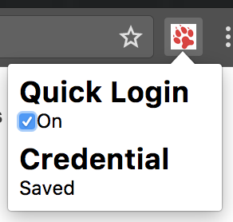
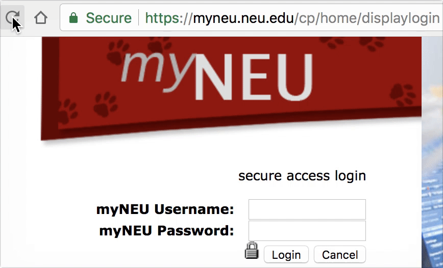

# muNEU-autoLogin

## Description
Automatically login into your myNEU in the [Displaylogin Page](https://myneu.neu.edu/cp/home/displaylogin).  
After your first manually login, your username and password will be saved via the [chrome.storage API](https://developer.chrome.com/apps/storage).   
Since then you can access myNEU just the on the fly.
## Quick Login
If you enable the `Quick Login` feature, you will login immediate after you visit the [Displaylogin Page](https://myneu.neu.edu/cp/home/displaylogin).   
Otherwise, you will have 3 seconds delay, and in the meanwhile you could click the `Cancel` button and the countdown will stop.

## Installation
Visit the [chrome web store](https://chrome.google.com/webstore/detail/myneu-autologin/epjnkjmpghgdlemckehgkjbnblbcchmc).
## License
[WTFPL](http://www.wtfpl.net/)
